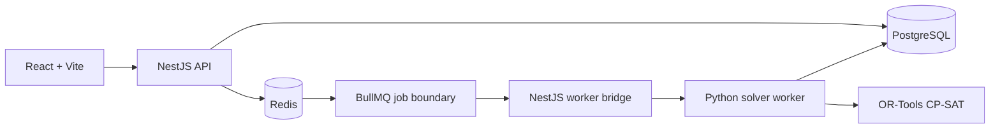

# Đường cơ sở kiến trúc

Quyết định về quyền sở hữu kho/mô-đun được ghi trong
[`ADR-001 — Repository và module boundaries`](architecture-decision-records/ADR-001-repository-and-module-boundaries.md).

## Tô-pô thời gian chạy

## Trách nhiệm

| Thành phần       | Phụ trách                                                            | Không phụ trách                                   |
| ---------------- | -------------------------------------------------------------------- | ------------------------------------------------- |
| React web        | Workflow người dùng, xem trước/chỉnh sửa, hỏi trạng thái             | Phân quyền hoặc quy tắc bộ tối ưu                 |
| NestJS API       | Ranh giới xác thực, kiểm tra, điều phối nghiệp vụ, lưu trữ, xếp hàng | Nội bộ mô hình CP-SAT                             |
| PostgreSQL       | Dữ liệu trường chuẩn, phiên bản, nhật ký và kết quả bộ tối ưu        | Điều phối tác vụ tạm thời                         |
| Redis + BullMQ   | Trạng thái tác vụ bền vững, thử lại và điều phối hàng đợi            | Dữ liệu nghiệp vụ chuẩn                           |
| Bộ tối ưu Python | Kiểm tra payload chuẩn, mô hình ràng buộc, chẩn đoán                 | Phân quyền người dùng/phiên                       |
| OR-Tools CP-SAT  | Tìm kiếm tính khả thi và tối ưu                                      | Nhập dữ liệu, công bố hoặc mối quan tâm giao diện |

## Ranh giới kho mã

Hai thư mục ứng dụng được tách riêng có chủ đích:

- `frontend`: lớp trình bày React + TypeScript + Vite và ranh giới client API.
- `backend`: API/lõi NestJS, bộ điều hợp PostgreSQL/Redis, cầu nối BullMQ và
  gói bộ tối ưu Python.
- `backend/contracts/schemas`: JSON Schema có phiên bản dùng chung bởi bộ điều
  hợp TypeScript và Pydantic.

Cây mô-đun chi tiết, quyền sở hữu dữ liệu, ranh giới bảo mật và các quyết định
không chọn được duy trì trong [ADR-001](architecture-decision-records/ADR-001-repository-and-module-boundaries.md).

## Ranh giới hợp đồng

`schemaVersion` bắt buộc có trong cả request và kết quả. API và worker Python
phải từ chối phiên bản phá vỡ không được hỗ trợ thay vì âm thầm ép kiểu trường.
`backend/contracts/schemas` được commit cùng bộ điều hợp để thay đổi hợp đồng có
thể review.

Thuật ngữ nghiệp vụ chuẩn và ánh xạ trường giữa các lớp được duy trì trong
[`docs/domain-glossary.md`](domain-glossary.md). In particular, the v1 wire
field `lessons[]` maps to the single domain concept `LessonRequirement`, while
`period`, `AcademicPeriod`, `OptimizationRun` and `ScheduleVersion` remain
distinct concepts.

Nguồn gốc quy tắc pháp lý và vận hành được duy trì trong
[`docs/legal-rule-register.md`](legal-rule-register.md). Các quy tắc đã kiểm chứng nguồn
không tự động trở thành ràng buộc bộ tối ưu: mô hình quy tắc phải có phiên bản,
nguồn, ngày hiệu lực, phạm vi áp dụng và phê duyệt trước khi NestJS và Python
thực thi nhất quán.

P2.1-T01 định nghĩa hợp đồng `RuleSetSnapshot` độc lập
(`RULE-SET-1.0.0`) và lưu trữ PostgreSQL `rule_set_snapshots`. Mỗi lần tối ưu
ghi nhận mã/phiên bản/mã băm bản chụp dùng cho khả năng tái lập; hợp đồng truyền
hiện tại vẫn là `schemaVersion: "1.0"` cho đến khi task sau bổ sung đánh giá quy tắc.

P2.1-T02 bổ sung báo cáo tải giáo viên do máy chủ sở hữu. Báo cáo lấy nhu cầu
tiết học tuần đang hoạt động từ PostgreSQL, đọc `RULE-TEACH-002`/`RULE-TEACH-003`
và các quy tắc `RULE-TEACH-REDUCTION-*` theo giáo viên từ bản chụp đã phê duyệt,
sau đó trả chỉ số tuần/năm có nguồn và mã băm. Kết quả mặc định là mục tiêu
trung bình (`REPORT_ONLY`); giới hạn tuần cứng chỉ được báo cáo/thực thi khi bản
chụp cấu hình rõ.

P2.1-T03 bổ sung projection có phiên bản `TEACHER-AVAILABILITY-1.0.0`. NestJS
chỉ đọc các định nghĩa `RULE-TEACHER-AVAILABILITY-*` đã phê duyệt, còn hiệu lực
từ bản chụp bất biến và ánh xạ bộ chọn ngày/buổi/tiết vào `time_slots` của khung
năm học. Python thực thi `HARD_UNAVAILABLE` bằng cách loại bỏ lựa chọn tương ứng
và giảm vi phạm `STRONG_PREFERENCE`/`SOFT_WISH` với cảnh báo chẩn đoán rõ ràng.
Giao diện không phải ranh giới thực thi.

P2.1-T04 bổ sung báo cáo điều kiện cần có phiên bản `PRE-SOLVE-1.0.0`. NestJS
cung cấp báo cáo trước khi xếp BullMQ và từ chối request được chứng minh là vô
nghiệm; Python lặp lại kiểm tra trước khi dựng mô hình CP-SAT. Báo cáo bao phủ
sức chứa nhu cầu/khung tiết theo lớp, sức chứa ứng viên giáo viên, xung đột khung
tiết cố định, sẵn sàng cứng của lớp và năng lực phòng tùy chọn.

Yêu cầu sản phẩm, hành trình người dùng và bằng chứng nghiệm thu được duy trì trong
[`docs/prd-mvp.md`](prd-mvp.md). PRD phân biệt bằng chứng phát triển cục bộ với
phê duyệt thí điểm/bên liên quan và các cổng production.

## Vòng đời tác vụ

1. API kiểm tra hình dạng request và mã định danh nghiệp vụ.
2. API xếp `optimization.solve` qua BullMQ.
3. Cầu nối worker NestJS chuyển cùng payload chuẩn sang tiến trình bộ tối ưu Python.
4. Worker Python kiểm tra payload, chạy CP-SAT và trả trạng thái, điểm, phân công,
   chẩn đoán cùng siêu dữ liệu bộ tối ưu có phiên bản.
5. BullMQ lưu kết quả hoàn tất và API cung cấp trạng thái tác vụ cho client web.

Cấu hình cục bộ đã triển khai luồng xếp API, cầu nối BullMQ và bộ tối ưu Python.
Lưu bền vững tập phân công hoàn tất vào PostgreSQL, phân quyền, thử lại/quan sát
và triển khai production vẫn là công việc tiếp theo.
