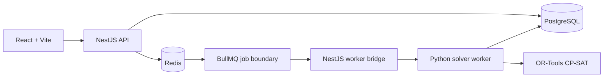

# Architecture Baseline

## Runtime topology

## Responsibilities

| Component | Owns | Does not own |
| --- | --- | --- |
| React web | User workflows, preview/edit, status polling | Authorization or solver rules |
| NestJS API | Auth boundary, validation, domain orchestration, persistence, enqueueing | CP-SAT model internals |
| PostgreSQL | Canonical school data, versions, audit and solver results | Transient job coordination |
| Redis + BullMQ | Durable job state, retries and queue coordination | Canonical business data |
| Python solver | Canonical payload validation, constraint model, diagnostics | User/session authorization |
| OR-Tools CP-SAT | Feasibility and optimization search | Import, publishing or UI concerns |

## Contract boundary

`schemaVersion` is mandatory on both request and result. The API and Python worker must reject unsupported breaking versions rather than silently coercing fields. `backend/contracts/schemas` is committed alongside adapters so contract changes are reviewable.

Canonical business terminology and cross-layer field mapping are maintained in
[`docs/domain-glossary.md`](domain-glossary.md). In particular, the v1 wire
field `lessons[]` maps to the single domain concept `LessonRequirement`, while
`period`, `AcademicPeriod`, `OptimizationRun` and `ScheduleVersion` remain
distinct concepts.

Legal and operational rule provenance is maintained in
[`docs/legal-rule-register.md`](legal-rule-register.md). Source-verified rules
are not automatically solver constraints: the rule model must carry version,
source, effective date, applicability and approval before NestJS and Python
enforce it consistently.

 Product requirements, user journeys and acceptance evidence are maintained in
 [`docs/prd-mvp.md`](prd-mvp.md). The PRD distinguishes local development evidence
 from pilot/stakeholder approval and production gates.

## Job lifecycle

1. API validates request shape and domain identifiers.
2. API enqueues `optimization.solve` through BullMQ.
3. NestJS worker bridge forwards the same canonical payload to the Python solver process.
4. Python worker validates the payload, runs CP-SAT and returns status, assignments and diagnostics.
5. BullMQ stores the completed result and the API exposes job status to the web client.

The local setup implements the API enqueue, BullMQ bridge and Python solver flow. Durable PostgreSQL persistence of the completed assignment set, authorization, retries/observability and production deployment remain follow-up work.
