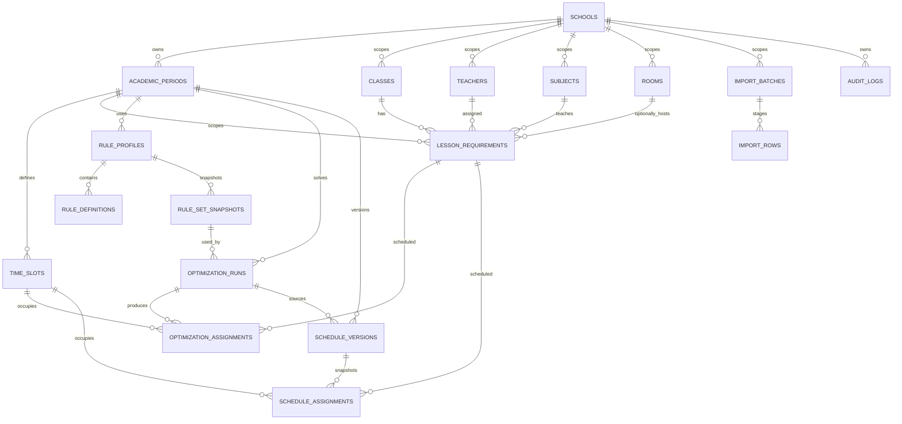

# PostgreSQL Domain Model & Persistence Proposal

**Product:** School Timetable Optimizer  
**Scope:** V0.1 — một trường THCS/THPT, web-first  
**Task:** P1.2-T01 design baseline; P2.1-T01 rule snapshot extension
**Status:** Design baseline plus implemented versioned rule snapshot persistence
**Updated:** 2026-08-25

Tài liệu này là schema proposal cho PostgreSQL. Nó làm rõ quan hệ, khóa tự
nhiên, tenant boundary, lifecycle và ranh giới với solver trước khi viết
migration. Các bảng `001_initial_contract.sql` và `002_import_workflow.sql` là
baseline đang chạy; chúng chưa được coi là toàn bộ schema MVP.

## 1. Quyết định thiết kế

- `School` là root scope. Mọi dữ liệu nghiệp vụ thuộc một school; các quan hệ
  chéo school phải được chặn bằng composite foreign key hoặc service
  validation tương đương.
- ID là opaque UUID. Mã nguồn từ Excel (`code`) là định danh ổn định để
  hiển thị/đối soát, không thay thế ID và không suy diễn ý nghĩa từ UUID.
- PostgreSQL dùng `snake_case`, thời điểm dùng `TIMESTAMPTZ`, ngày nghiệp vụ
  dùng `DATE`, và school lưu IANA timezone để hiển thị nhất quán. Mặc định
  local demo là `Asia/Ho_Chi_Minh`; đây không phải quyết định pilot.
- `AcademicPeriod` là phạm vi nghiệp vụ của một năm học/kỳ học và khác hoàn
  toàn `TimeSlot.period` (thứ tự tiết trong ngày). Giữ tên bảng
  `academic_periods` để tương thích glossary và baseline.
- MVP chỉ có lớp thông thường. Không tạo bảng/quan hệ cho lớp ghép, lớp tách
  hoặc nhóm học sinh; input chứa loại lớp ngoài phạm vi phải bị từ chối.
- Các row mutable có `created_at`, `updated_at` và trạng thái/lifecycle phù
  hợp. Không hard-delete dữ liệu đã tham gia solve, publish hoặc audit nếu
  retention policy chưa cho phép.
- Schema này không thay đổi wire contract `schemaVersion: "1.0"`. NestJS
  chọn đúng school/academic period rồi mới dựng payload `lessons[]` và
  `timeSlots[]` cho Python; Python không sở hữu authorization hay persistence.

## 2. ERD logic

## 3. Entity and key proposal

| Entity / table | Core fields | Required integrity and lifecycle |
| --- | --- | --- |
| `School` / `schools` | `id`, `code`, `name`, `timezone`, `status`, audit timestamps | `code` unique; `status` is `ACTIVE` or `ARCHIVED`; all child rows carry `school_id` directly or through a period. |
| `AcademicPeriod` / `academic_periods` | `id`, `school_id`, `academic_year`, `term_code`, `name`, `starts_on`, `ends_on`, `status` | Unique `(school_id, academic_year, term_code)`; `ends_on >= starts_on`; status `DRAFT`, `ACTIVE`, `ARCHIVED`; no overlap check is assumed until the pilot defines whether terms may overlap. |
| `Class` / `classes` | `id`, `school_id`, `code`, `name`, `grade`, `status` | Unique `(school_id, code)` and `(school_id, name)`; grade `6..12`; one row is one standard class, with no combined/split-class table. |
| `Teacher` / `teachers` | `id`, `school_id`, `code`, `display_name`, `status` | Unique `(school_id, code)`; code is the stable Excel join key; names may change without changing ID/code. |
| `Subject` / `subjects` | `id`, `school_id`, `code`, `name`, `status` | Unique `(school_id, code)` and optionally normalized name per school; code is the stable import key. |
| `Room` / `rooms` | `id`, `school_id`, `code`, `name`, `room_type`, `capacity`, `status` | Unique `(school_id, code)`; positive capacity when present; no room assignment is added to solver v1 until its contract is versioned. |
| `TimeSlot` / `time_slots` | `id`, `school_id`, `academic_period_id`, `day`, `period`, optional `shift_code`, `starts_at`, `ends_at` | Unique `(academic_period_id, day, period)`; day `1..7`, period `>= 1`; `starts_at/ends_at` are local wall-clock values tied to school timezone. |
| `LessonRequirement` / `lesson_requirements` | `id`, `school_id`, `academic_period_id`, `class_id`, `subject_id`, `teacher_id`, optional `room_id`, `required_sessions`, `status` | Unique `(academic_period_id, class_id, subject_id, teacher_id)` for the MVP; `required_sessions > 0`; all referenced master rows must belong to the same school. Wire collection remains `lessons[]`. |
| `RuleProfile` / `rule_profiles` | `id`, `school_id`, `academic_period_id`, `version`, `register_version`, `name`, `status`, source URL/locator, `scope`, `effective_from`, `effective_to`, approval fields | Versioned and immutable after activation; status `DRAFT`, `ACTIVE`, `RETIRED`; source/effective/scope/approval metadata is mandatory before enforcement. |
| `RuleDefinition` / `rule_definitions` | `id`, `rule_profile_id`, `code`, `kind`, `weight`, source URL/locator, `scope`, `effective_from`, `effective_to`, approval fields, `parameters` | Unique `(rule_profile_id, code)`; `kind` is `HARD` or `SOFT`; hard rules have no soft weight, soft rules have a non-negative weight; parameters remain JSONB but are validated by the rule layer. |
| `RuleSetSnapshot` / `rule_set_snapshots` | `id`, `rule_profile_id`, `rule_set_version`, profile/register versions, source/effective/scope/approval metadata, canonical `rules`, `snapshot_hash`, capture actor/time | Append-only immutable snapshot. `snapshot_hash` is SHA-256 of the canonical payload excluding the hash itself; expired/unapproved snapshots are not effective. |
| `OptimizationRun` / `optimization_runs` | `id`, `school_id`, `academic_period_id`, `job_id`, `status`, `contract_version`, `rule_snapshot_id`, `rule_set_version`, `rule_snapshot_hash`, timestamps, `diagnostics` | Run is separate from a schedule version and records the exact rule snapshot used for reproducibility; status follows queue/solver lifecycle; result rows are immutable after completion. |
| `OptimizationAssignment` / `optimization_assignments` | `run_id`, `lesson_id`, `session_index`, `time_slot_id` | Unique `(run_id, lesson_id, session_index)`; a run must not place one class or teacher twice in one slot. The latter conflict is enforced in solver/domain validation and, when persistence is implemented, with a materialized assignment scope. |
| `ScheduleVersion` / `schedule_versions` | `id`, `school_id`, `academic_period_id`, `version_number`, `status`, `source_run_id`, `created_by`, approval/publish/lock timestamps | Unique `(academic_period_id, version_number)`; lifecycle `DRAFT → APPROVED → LOCKED → PUBLISHED`; no overwrite of an existing published snapshot. |
| `ScheduleAssignment` / `schedule_assignments` | `schedule_version_id`, `lesson_id`, `session_index`, `time_slot_id`, optional `room_id` | Snapshot rows are immutable once locked/published; same class/teacher/room collision rules apply within a version. |
| `ImportBatch` / `import_batches` and `ImportRow` / `import_rows` | Existing staging fields plus `academic_period_id` when import scope is finalized; confirm checksum, school-scoped idempotency key, confirming actor and persisted result | Preview/validation stays staging-only; confirm locks the batch and commits domain rows, batch result and one audit event atomically. |
| `AuditLog` / `audit_logs` | Existing `school_id`, actor, action, entity, metadata, timestamp | Append-only event boundary; deduplication is allowed only for the same idempotent action/entity pair. |

## 4. Cross-school and duplicate protection

The migration implementation should prefer these constraints rather than
relying only on controller checks:

- Add a unique `(school_id, id)` key to school-scoped parents where needed, then
  use composite foreign keys such as `(school_id, class_id)` and
  `(school_id, teacher_id)` from `lesson_requirements`.
- Use partial/functional indexes only when the chosen PostgreSQL version and
  normalization policy are documented. Until then, canonical codes should be
  trimmed and case-normalized at the API boundary before the unique key is
  checked.
- Keep the lesson natural key period-scoped. A new academic period may reuse a
  class/subject/teacher combination, but the same combination must not silently
  create two requirements in one period.
- Migration `003_domain_persistence.sql` creates a diagnostic index for this
  natural key instead of a unique constraint because the existing local QC
  database contains confirmed re-import rows with duplicates. P1.2-T03 must
  decide the approved re-import/upsert policy and then promote this to enforced
  uniqueness for active domain data without deleting legacy evidence.
- Keep `ON DELETE` restrictive for master data referenced by requirements,
  runs, versions or audit records. Use cascade only for staging rows under an
  import batch and for child rows of an explicitly disposable draft.

## 5. Transaction and lifecycle boundaries

1. **Master-data transaction:** create/update one school-scoped entity and its
   audit event together; reject cross-school references.
2. **Import confirm transaction:** lock the previewed batch, re-check its
   status and counts, insert all normalized requirements, update the batch and
   write `IMPORT_CONFIRMED`; any failure rolls back the whole import.
3. **Solve transaction:** create an `OptimizationRun` before enqueueing; the
   worker records the terminal status, the exact rule snapshot reference and
   immutable assignments separately from any user-editable schedule version.
4. **Version transaction:** copy a result into a draft `ScheduleVersion`; edit,
   approval, lock and publish are explicit transitions with audit entries.
5. **Time handling:** persist business dates and local slot times without
   converting a school calendar into UTC periods; use `TIMESTAMPTZ` only for
   system/audit timestamps.

## 6. Compatibility with the solver contract

The proposal intentionally keeps the current `schemaVersion: "1.0"` boundary
and adds an independent `RuleSetSnapshot` contract version
`RULE-SET-1.0.0`:

- NestJS resolves `schoolId`, `academicPeriodId`, master references and the
  versioned rule snapshot before constructing the request; the request may carry
  its snapshot id/version/hash as additive metadata.
- The Python request continues to receive `schoolId`, `timeSlots[]` and
  `lessons[]`; `lessons[]` remains the wire name for `LessonRequirement`.
- `room_id`, `schedule_version_id` and schedule approval state remain
  persistence concerns. Rule snapshot identity is additive request/result
  metadata, while PostgreSQL remains the source of truth for the snapshot body.
- The current Python solver interprets the versioned availability projection;
  P2.1-T02 covers teacher-load evaluation and P2.1-T03 covers hard filtering
  plus weighted preference penalties against the approved snapshot.
- Any future addition of `academicPeriodId`, `roomId`, soft constraints or
  schedule-version fields must update JSON Schema, TypeScript, Pydantic, the
  glossary and tests in one change.

## 7. Implementation split and open decisions

### Historical P1.2-T02 implementation boundary

- Forward-only migration(s) for the approved subset of this proposal.
- Stable master-data codes, period scope and composite school-boundary checks.
- Repeatable demo seed fixtures without destructive baseline statements.
- Migration and seed verification against PostgreSQL.
- A diagnostic natural-key index is present; uniqueness across import batches is
  intentionally deferred to the re-import policy task because local QC evidence
  already contains duplicate legacy rows.

### P1.2-T03/T04/T05 or later will implement

- CRUD/repositories, RBAC, audit API and schedule-version lifecycle.
- Rule profile/definition business validation and solver-facing rule evaluation;
  P2.1-T01 now provides the persistence/contract foundation.
- Room assignment and any expanded solver contract.

The following remain explicit decisions for the pilot owner: exact academic year
and term codes, school calendar/shift/time mapping, stable code format, room
capacity semantics, import re-run policy, and audit/retention period. This
proposal does not claim those stakeholder or production gates are closed.

## 8. Traceability

- Canonical names: `docs/domain-glossary.md`.
- Product scope and gate separation: `docs/prd-mvp.md`.
- Current executable baseline: `backend/database/migrations/001_initial_contract.sql`
  and `002_import_workflow.sql`.
- P2.1-T01 evidence: `backend/database/migrations/007_versioned_rule_set_snapshots.sql`,
  `backend/contracts/schemas/rule-set-snapshot.schema.json` and the NestJS/Python
  rule contract tests.
