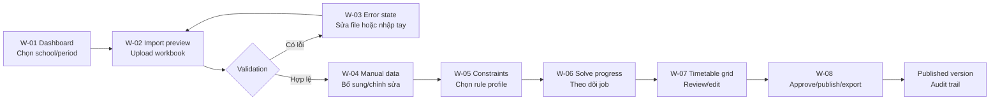

# P0.2-T04 — User journey và wireframe end-to-end

**Product:** School Timetable Optimizer  
**Version:** `MVP-0.1.0` · **Wireframe:** `v0.1` · **Updated:** 2026-08-24  
**Status:** Implementation design — low fidelity, sẵn sàng handoff cho frontend

## 1. Mục tiêu và phạm vi

Tài liệu này là hợp đồng UX cho luồng chính của MVP: từ khi người phụ trách
thời khóa biểu chuẩn bị dữ liệu đến khi approver duyệt, khóa, công bố và xuất
thời khóa biểu. Wireframe tập trung vào hierarchy, trạng thái và hành động;
chưa chốt màu thương hiệu, icon set hoặc visual polish.

Phạm vi bao gồm:

- Dashboard và trạng thái workspace/academic period.
- Upload Excel, preview, validation và màn hình lỗi.
- Nhập tay lesson requirements.
- Cấu hình ràng buộc và rule profile.
- Solve progress, kết quả và diagnostics.
- Lưới lịch theo lớp/giáo viên/phòng, review/edit.
- Approval, lock, publish và export.

Không mở rộng scope sang multi-school hoàn chỉnh, lớp ghép/lớp tách, offline,
AI solver hoặc tự động quyết định approver.

## 2. Persona và journey chính

| Persona | Mục tiêu | Quyền trong journey |
| --- | --- | --- |
| Người phụ trách thời khóa biểu | Chuẩn hóa input và tạo draft khả thi | Tạo period, import/nhập tay, validate, solve, review/edit |
| Approver/Ban giám hiệu | Đánh giá và phát hành phương án | Xem diagnostics, approve/reject, lock, publish, export |
| Giáo viên | Cung cấp thông tin và xem lịch | Xem lịch được cấp quyền; input availability theo policy |

### Happy path



Mỗi bước chỉ có một primary action. Khi chưa đủ điều kiện, primary action bị
disable và ngay cạnh đó hiển thị lý do cùng hành động khôi phục. Người dùng
không bị đưa thẳng sang màn hình tiếp theo nếu dữ liệu chưa được confirm.

### Quy tắc chuyển trạng thái

| Từ | Điều kiện | Sang | Feedback bắt buộc |
| --- | --- | --- | --- |
| Workspace chưa chọn period | Chọn school + academic period hợp lệ | Dashboard ready | `Đã chọn ...` trong live region |
| Import draft | Preview trả về `canConfirm=false` | Validation error | Số lỗi, dòng/cột, cách sửa |
| Import draft | `canConfirm=true` và user xác nhận | Imported | Batch ID, số dòng, audit result |
| Imported | Có dataset và rule profile | Solve queued | Job ID và thời điểm enqueue |
| Solve queued/running | API trả terminal result | Review | `OPTIMAL/FEASIBLE/INFEASIBLE/UNKNOWN` + diagnostics |
| Review | Không có hard conflict | Approval ready | Số thay đổi và version draft |
| Approval ready | Approver approve + lock | Published | Actor, timestamp, version, export actions |

## 3. Screen/state contract

Mọi màn hình dưới đây phải có bốn trạng thái tối thiểu: `empty`, `loading`,
`error`, `ready/success`. Trạng thái không chỉ dùng màu; luôn có heading, mô tả
và hành động tiếp theo.

| ID | Màn hình | Empty | Loading/processing | Error | Ready/success | Primary CTA |
| --- | --- | --- | --- | --- | --- | --- |
| W-01 | Dashboard | Chưa có period/draft | Đang tải workspace | Không tải được dữ liệu | KPI batch/job/version và next step | `Tạo academic period` hoặc `Tiếp tục draft` |
| W-02 | Import preview | Chưa chọn file | `Đang đọc và kiểm tra workbook` | Sai loại file/template hoặc HTTP error | Bảng preview, metrics, confirm state | `Upload & Preview`, sau đó `Confirm Import` |
| W-03 | Validation/error | Chưa có lỗi | Đang chạy lại validation | Lỗi theo row/field/code | Danh sách lỗi và link tới dòng | `Tải file đã sửa lên` hoặc `Nhập tay` |
| W-04 | Manual data | Chưa có requirement | Đang lưu/validate row | Lỗi field/reference/duplicate | Bảng row đã lưu và counter | `Thêm requirement` / `Lưu thay đổi` |
| W-05 | Constraints | Chưa chọn profile | Đang tải profile | Profile thiếu version/approval | Rule cards, source, weight, effective date | `Áp dụng profile` |
| W-06 | Solve progress | Chưa có request | `Queued → Running`, poll có giới hạn | Failed/timeout/UNKNOWN | Result status, objective, diagnostics | `Xem kết quả` hoặc `Chạy lại có kiểm soát` |
| W-07 | Timetable grid | Chưa có solution | Đang tải assignments | Conflict khi edit hoặc result không khả thi | Grid theo class/teacher/room | `Lưu draft` / `Mở approval review` |
| W-08 | Approval/export | Chưa có draft để duyệt | Đang lock/publish/export | Thiếu quyền, chưa lock, export failed | Version, approver, audit, file download | `Approve`, `Lock`, `Publish`, `Export` theo điều kiện |

## 4. Low-fidelity wireframes

Các khối dưới đây mô tả bố cục và copy tối thiểu. `*` là primary action; các
action còn lại phải nằm ở secondary action hoặc contextual action.

### W-01 — Dashboard / workspace

```text
+--------------------------------------------------------------------------------+
| School Timetable Optimizer                 [School ▼] [Academic period ▼]     |
|--------------------------------------------------------------------------------|
| Workspace status: READY                                                        |
|                                                                                |
| [Data input]             [Latest solve]             [Published version]         |
| 0 rows / 0 errors         Chưa chạy                 Chưa có                    |
|                                                                                |
| Next step: Chọn cách bắt đầu                                                   |
| [* Upload Excel] [Nhập tay] [Xem template]                                    |
|                                                                                |
| Recent activity / Audit                                                      |
| Empty: Chưa có hoạt động. Hãy upload hoặc nhập requirement đầu tiên.           |
| Loading: Đang tải activity…                                                    |
| Error: Không tải được activity. [Thử lại]                                     |
+--------------------------------------------------------------------------------+
```

### W-02 — Import preview

```text
+--------------------------------------------------------------------------------+
| 1. Input > 2. Validate > 3. Confirm > 4. Solve                                |
|--------------------------------------------------------------------------------|
| Upload workbook theo template v1.0                         [Download template] |
| [ Chọn file .xlsx/.xlsm ]                                    [* Upload & Preview]|
| Hint: Mã lớp · Mã môn · Mã giáo viên · Số tiết · Mã phòng (optional)           |
|--------------------------------------------------------------------------------|
| Preview: school-timetable.xlsx                 Batch: <opaque batch id>        |
| [12 dòng] [12 hợp lệ] [0 lỗi]                         [Sẵn sàng Confirm]       |
|--------------------------------------------------------------------------------|
| Dòng | Mã lớp | Mã môn | Mã GV | Số tiết | Mã phòng | Trạng thái               |
|  2   | 9A     | MATH   | GV-01 |    5    | P-101    | Hợp lệ                  |
| ...                                                                          |
|                                                                                |
| [Quay lại]                                      [* Confirm Import] (enabled)   |
| Empty: Chưa có file. Loading: Đang đọc workbook…                              |
| Error: Không thể đọc file. [Chọn file khác]                                   |
+--------------------------------------------------------------------------------+
```

### W-03 — Validation/error details

```text
+--------------------------------------------------------------------------------+
| Validation issues                                             [12 dòng] [5 lỗi]|
|--------------------------------------------------------------------------------|
| [Lỗi] Dòng 8 · Mã giáo viên                                                    |
| Mã giáo viên GV-99 không tồn tại trong master data.                            |
| Cách sửa: dùng mã đã có hoặc bổ sung master data trước khi preview lại.         |
|                                                                                |
| [Cảnh báo] Dòng 11 · Mã phòng                                                  |
| Mã phòng trống; hệ thống sẽ để solver tự chọn nếu policy cho phép.             |
|                                                                                |
| [* Upload file đã sửa] [Nhập tay dòng lỗi] [Download error report]             |
| Confirm Import: DISABLED — Còn 5 lỗi cần xử lý.                                |
| Empty: Không có lỗi. Bạn có thể Confirm Import.                                |
| Loading: Đang kiểm tra lại…                                                    |
| Error: Không nhận được kết quả validation. [Thử lại]                          |
+--------------------------------------------------------------------------------+
```

### W-04 — Manual data entry

```text
+--------------------------------------------------------------------------------+
| Manual lesson requirements                 Source: Imported batch <id>         |
|--------------------------------------------------------------------------------|
| [* + Thêm requirement] [Validate all]                     8 rows · 1 lỗi       |
|                                                                                |
| Mã lớp   | Mã môn | Mã GV  | Số tiết | Allowed/fixed slot | Status             |
| 9A       | MATH   | GV-01  | [ 5 ]   | [Auto ▼]            | Hợp lệ             |
| 9A       | PHYS   | [GV-99] | [ 3 ]  | [Auto ▼]            | Lỗi reference      |
|                                                                                |
| Row error: Mã GV-99 không tồn tại. [Sửa row]                                  |
| [Hủy thay đổi]                                            [* Lưu thay đổi]     |
| Empty: Chưa có requirement. [Thêm requirement đầu tiên]                       |
| Loading: Đang validate và lưu…                                                 |
| Error: Không lưu được row. Dữ liệu chưa thay đổi. [Thử lại]                   |
+--------------------------------------------------------------------------------+
```

### W-05 — Constraint/rule profile

```text
+--------------------------------------------------------------------------------+
| Constraint profile                                           [Version 1.0]     |
|--------------------------------------------------------------------------------|
| Profile: [THCS default ▼]   Source: legal-rule-register.md   Status: APPROVED |
| Effective: 2026-08-01      Approver: <actor>                                  |
|                                                                                |
| HARD constraints                                                               |
| [x] Không trùng lớp trong cùng TimeSlot                                       |
| [x] Không trùng giáo viên trong cùng TimeSlot                                 |
| [x] requiredSessions phải được đáp ứng                                        |
|                                                                                |
| SOFT constraints / weights                                                     |
| [ ] Tránh tiết cuối tuần       Weight [ 10 ]  Source [policy]                 |
|                                                                                |
| Empty: Chưa có profile được approve. [Xem blocker]                            |
| Loading: Đang tải profile…                                                     |
| Error: Profile thiếu version/source/approval; không thể áp dụng. [Quay lại]    |
| [Hủy]                                                     [* Áp dụng profile]   |
+--------------------------------------------------------------------------------+
```

### W-06 — Solve progress/result

```text
+--------------------------------------------------------------------------------+
| Solve run: <opaque job id>                                  Dataset v1.0       |
|--------------------------------------------------------------------------------|
| QUEUED  ─────────  RUNNING  ─────────  COMPLETED                               |
| [██████████████░░░░░░] Đang giải · không đóng tab cần thiết                     |
|                                                                                |
| Time limit: 60s | Started: <time> | Last update: <time>                        |
|                                                                                |
| Result: OPTIMAL     Assignments: 40     Objective: —                           |
| Diagnostics: 0 hard conflicts · 0 warnings                                     |
|                                                                                |
| Error state: Solver không khả thi. Xem 2 hard conflicts. [Xem diagnostics]     |
| Unknown/timeout: Đã hết time limit, chưa có kết luận. [Điều chỉnh và chạy lại] |
| [Quay lại constraints]                                  [* Xem timetable]      |
+--------------------------------------------------------------------------------+
```

### W-07 — Timetable grid / review-edit

```text
+--------------------------------------------------------------------------------+
| Draft v0.1 · OPTIMAL                 [Theo lớp ▼] [Theo GV] [Theo phòng]       |
|--------------------------------------------------------------------------------|
| Filters: [9A ▼] [Tuần 1 ▼] [Tất cả conflicts]              40 assignments      |
|                                                                                |
|         T2-T1      T2-T2      T3-T1      T3-T2      T4-T1                     |
| 9A      MATH       PHYS       —          ENG        —                          |
| 9B      —          CHEM       MATH       —          LIT                        |
|                                                                                |
| Selected: 9A / MATH / GV-01 / T2-T1                                           |
| [Đổi slot ▼] [Khóa assignment]                                                 |
| Conflict preview: Hợp lệ / hard conflict / soft warning + rule code            |
|                                                                                |
| Empty: Chưa có assignment. [Quay lại Solve]                                    |
| Loading: Đang tải grid…                                                        |
| Error: Không thể lưu thay đổi; draft vẫn giữ bản trước. [Thử lại]              |
| [Discard changes]                                      [* Lưu draft]            |
+--------------------------------------------------------------------------------+
```

### W-08 — Approval, lock, publish, export

```text
+--------------------------------------------------------------------------------+
| Approval review · Draft v0.1                              Status: READY        |
|--------------------------------------------------------------------------------|
| Rule profile: THCS default v1.0 | Solver: OPTIMAL | Hard conflicts: 0          |
| Changes since import: 3 | Audit entries: 8 | Preview export: available        |
|                                                                                |
| [View timetable] [View diagnostics] [View audit] [Preview Excel/PDF]            |
|                                                                                |
| Approver decision                                                               |
| [Reason / comment ________________________________________________]             |
| [Reject with reason]                                   [* Approve version]     |
|                                                                                |
| After approve: [* Lock version] → [* Publish] → [Export Excel] [Export PDF]    |
| Empty: Chưa có draft được submit. [Quay lại review]                           |
| Loading: Đang ghi approval/lock/publish…                                       |
| Error: Thiếu quyền hoặc version chưa lock; không publish/export. [Xem lý do]   |
| Success: Published v0.1 bởi <actor> lúc <timestamp>.                           |
+--------------------------------------------------------------------------------+
```

## 5. Feedback và accessibility contract

| Tình huống | Feedback người dùng | Cách ghi nhận |
| --- | --- | --- |
| Upload/preview bắt đầu | `Đang đọc workbook và kiểm tra ...` | Inline status, `aria-live="polite"` |
| File sai loại/template | `Định dạng/template không hợp lệ` + cách sửa | Alert có `role="alert"`, giữ file picker usable |
| Validation lỗi | Row, field, error code, message, cách sửa | Error summary + focus tới first error |
| Confirm thành công | Batch ID, số dòng, audit message | Success status + link sang batch/audit |
| Solve running | Queue state, job ID, last update, bounded polling | Progress status; không giả đoán percentage |
| Infeasible/unknown | Status canonical + hard conflict/diagnostic | Không hiện timetable như kết quả hợp lệ |
| Edit conflict | Rule code, dữ liệu xung đột, action sửa | Inline row/cell message, không chỉ đổi màu |
| Approve/publish/export | Actor, version, timestamp, kết quả | Audit panel và toast/status bền vững |

Accessibility baseline: mọi input có label; thao tác chính dùng được bằng
keyboard; focus không bị mất khi preview/error thay đổi; bảng có header và
mobile scroll; màu sắc chỉ là bổ trợ, không phải thông tin duy nhất.

## 6. Contract và API alignment

T04 không tạo API/schema mới. Wireframe dùng các contract hiện có và đánh dấu
phần chưa có API bằng trạng thái thiết kế để tránh frontend tự suy diễn.

| UX action | API/contract hiện có | Dữ liệu hiển thị |
| --- | --- | --- |
| Health badge | `GET /api/v1/health` | online/offline/checking |
| Preview Excel | `POST /api/v1/imports/preview` | `rowCount`, `validRowCount`, `errorCount`, `canConfirm`, `rows[]`, `errors[]` |
| Confirm import | `POST /api/v1/imports/{importBatchId}/confirm` | `status`, `validRowCount`, `auditLog` |
| Audit import | `GET /api/v1/imports/{importBatchId}/audit` | actor, message, createdAt |
| Enqueue solve | `POST /api/v1/optimization-jobs` | `jobId`, queue state |
| Poll solve | `GET /api/v1/optimization-jobs/{jobId}` | `OPTIMAL`, `FEASIBLE`, `INFEASIBLE`, `UNKNOWN`, assignments, diagnostics |
| Manual/constraint/review/approval/export | Chưa có endpoint trong T04 | Wireframe chỉ là interaction contract; task domain/API tương ứng sẽ bổ sung contract trước khi code |

Canonical IDs remain opaque strings (`schoolId`, `jobId`, `lessonId`, `slotId`);
the UI never parses or generates business meaning from an ID. `schemaVersion`
remains `1.0`; NestJS and Python continue to consume the same JSON contract.

## 7. Handoff checklist

- [x] Main journey has one primary action per step and explicit recovery path.
- [x] Every screen specifies empty, loading, error and ready/success states.
- [x] Error feedback includes row/field/code/message where validation applies.
- [x] Import and solve screens map to current NestJS/API/Python status contracts.
- [x] Approval/publish/export boundary is explicit; no UI implies unapproved data is published.
- [x] No new API/schema or hidden NestJS/Python divergence is introduced.
- [ ] Browser visual/E2E evidence for future production screens — follow-up implementation gate.

## 8. Next implementation boundary

The existing frontend remains the executable import/validation slice. This
wireframe is the source of truth for the next frontend/domain tasks: manual
input parity, constraint profile, solve status/result, review/edit and approval
workflow. Production pilot approval is intentionally outside this task.
